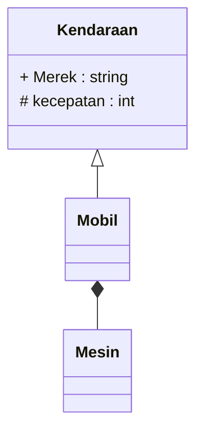

# Diagram Hierarki Kelas (UML) — Perpustakaan

Gambarkan diagram UML yang menunjukkan **hubungan antar kelas** di pertemuan ini, di bagian **bawah** penanda di akhir berkas ini. Format bebas — boleh kotak ASCII/Mermaid (`classDiagram`) atau daftar bertingkat. Yang wajib ada:

- Kelas `Anggota`, `Mahasiswa`, `Dosen`, `Asisten`, `Alamat`, dan `LogAktivitas`.
- Hubungan **pewarisan** (*is-a*): panah segitiga kosong dari kelas turunan ke kelas induk (`<|--` di Mermaid, atau `▲`, atau tulis "extends"/"turunan dari").
- Hubungan **komposisi** (*has-a*): berlian terisi dekat pihak pemilik (`*--` di Mermaid, atau `◆`, atau tulis "komposisi"/"memiliki") — siapa memiliki siapa?
- Anggota `protected` ditandai dengan simbol `#` (mis. `# BatasPinjam`), `public` dengan `+`, `private` dengan `-`.

Contoh format Mermaid (untuk kelas lain, bukan jawaban):

Jangan hapus baris penanda di bawah ini — jawaban kalian harus ditulis **setelah** baris itu, bukan sebelumnya.

<!-- TULIS JAWABAN KALIAN DI BAWAH BARIS INI -->
